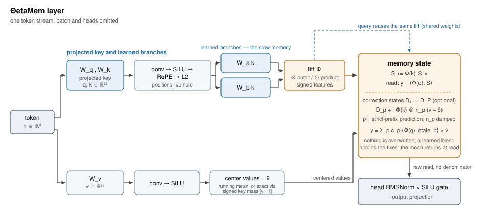
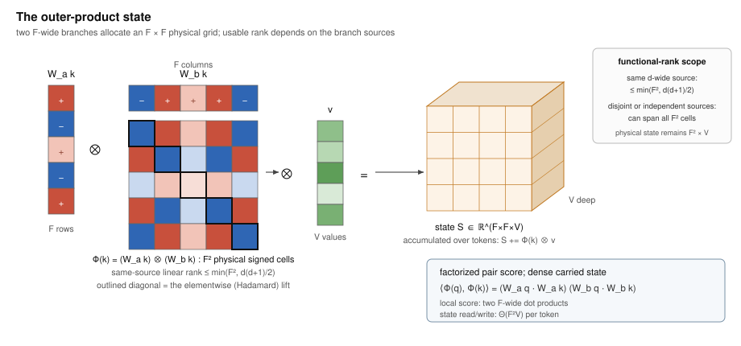

# ΘetaMem: Signed Multiplicative Lifts for Fixed-State Sequence Memory

### In search of the most efficient state: signed tensor-product keys for linear-time sequence models

**The ThetaMem Project** · **Versioned Technical Paper / Public Preview v0.1.1** · 2026-08-13 · contact: **hi@aim.do** · code: <a href="https://github.com/aim-do/thetamem"> **github.com/aim-do/thetamem**</a>

> **Θ** stands for the alignment between a stored key and the key that later queries it. Every mechanism in this paper is judged by one quantity: how fast the weight of a read falls as that alignment degrades. A linear address makes the weight fall with a single overlap; the two-factor construction studied here multiplies two independently learned projections, so the weight is a *product of two* overlaps and falls twice as fast — and, unlike a squared overlap, it keeps its sign. Using the outer rather than the elementwise product additionally allocates a second state axis. Sharper separation or a larger state, without leaving the linear-time scan family.
>
> **Spelling.** The display name **ΘetaMem** uses the Greek capital theta. The ASCII spelling **ThetaMem** is used in filenames, source code, package metadata, and plain-text citations.
>
> **Patent notice.** Core memory mechanisms described here are the subject of U.S. Provisional Patent Application No. **64/132,046**, *Signed Multiplicatively Lifted Sequence Memories*. Open directions are research hypotheses, and this notice makes no representation about the scope of any claim. It does not grant a license.
>
> **Status and scope: preliminary.** This is a versioned public preview, not an archival or final paper. The shipped library implements the two-factor signed lifts, additive and delta writes, the strict-prefix second pass, a causal repeated-pass approximation, value centering, and separate offline replay solvers. Section 5 is an idealized random-key analysis supported by small NumPy simulations; it is not a trained-model result. The global least-squares discussion in Section 6.2 concerns replay of a completed record set, not one-pass streaming. The benchmark study is explicitly in progress, and algorithms, terminology, and conclusions may change in later numbered previews.

---

## Abstract

Fixed-state token mixers process a sequence in linear time by writing every token into a state of constant size. The linear time is why the family matters; the constant size is why it forgets: new writes land on top of old records, and a memory that cannot keep everything should at least keep the **latest record for each key** readable. Even that is not granted: between its write and the query that finally needs it, a record degrades under every intervening write — *even writes of dissimilar tokens*, because all writes spend the same shared feature directions — and a single corrective write does not stop the drift. What such a state can do is set by several properties at once: its **capacity** (how many records fit), its **noise** (the part of a read that comes from every record except the one asked for), and its **retention** (how long a record survives later writes). Three levers move that budget — a larger state, key nonlinearities that make unrelated records interfere less, and corrections cheap enough to repeat until the records decorrelate. ΘetaMem is a memory design that pulls all three levers at once, in search of the most efficient state: the most usable records per state float, per trained parameter, and per unit of compute.

The paper is organized around four hypotheses about how to spend a fixed state, and it reports what each one currently rests on. **H1**: learned **outer products** enlarge the physical state while keeping the surrounding projections narrow — and the same multiplication sharpens the read: a product of two overlaps falls twice as fast as one. **H2**: **signed** decorrelated factors address that state better than positive geometries at a comparable key budget, because nonnegative read weights cannot cancel and their cross-talk accumulates coherently. **H3**: Gram-overlap error can be corrected **without erasing**, and one correction is not the natural stopping point — the practical target is retention: cheap, repeatable corrections that keep the latest record for a key readable under the writes that follow it, without bleeding the archive. **H4**: signed cancellation is conditional on **centered values**, so centering is part of the mechanism rather than an option.

The shipped library implements two-factor Hadamard and outer lifts, subtractive value centering, a strict-prefix second pass, a causal repeated-pass approximation, delta writes, and separate non-causal replay solvers. The evidence is mixed in kind, and stated as such.

H1 and H2 have trained support. On multi-query associative recall [5], at a state matched to the baseline's 8,192 floats, the elementwise memory reaches **0.668** on a 4× length-extrapolation slice against Gated DeltaNet-2's **0.567** [12], with no erasure and no correction; given a wider physical key the same baseline reaches **0.814**, and only the tensor state passes it, at **0.976** for 32× the state floats. Against an exact grouped positive-semidefinite (PSD) self-product [17], trained at equal key width and equal parameters, a signed product state holds a 4,096-token slice at **0.742** where the PSD arm falls to **0.024**. H2 also has an idealized random-key surrogate that isolates geometry alone, where the signed code carries **2.61×** less interference power at nearly equal state. H3 has surrogate support and one nearly neutral trained cell (**0.662** against **0.668**). H4 is implemented and tested but not yet benchmarked.

The losses are part of the result. On MAD fuzzy recall [7] our constant-state variant reaches **0.181** against the baseline's **0.323** and its wider-key control's **0.596**; only the tensor state passes both, at **0.714**. All trained results are single-seed synthetic studies. The evidence motivates outer products, signed geometry, and multi-step correction; it does not establish a worst-case or language-model capacity law.

---

## 1. Introduction

Why study another fixed-state token mixer? Because modern language models already rely on them. Attention gives exact recall at a cost that grows with context; a recurrent mixer with a fixed state keeps memory and compute per token constant [1, 8, 23, 24]. Production-scale systems increasingly pair the two. The open question is not whether fixed-state memories will be used, but how much recall a fixed state can offer.

The capacity question is usually asked about size: how many features, how many heads, how wide a value. We ask it about the **joint characteristics of the state**. A bounded associative memory returns, for any query, the record it stored plus a weighted sum of every other record it stored [2]. How useful the state is depends on its capacity, on that noise term, and on how long a record survives — and these are not independent dials. Noise grows with occupancy; retention falls when writes erase; capacity is empty if reads cannot separate records. Every design decision below is a decision about this joint budget.

Two arithmetic facts frame the whole problem. First, **the state must be large enough for its occupancy**. Under an ideal isotropic random-key model, a memory with $R$ usable feature directions holds on the order of $\varepsilon^2R$ unrelated records at noise-to-signal $\varepsilon$. This is a model, not a universal law. Second, **physical width is not functional rank**. A linear map of a $d$-dimensional key spans at most $d$ linear functions, and two bias-free linear branches from that same key span at most $d(d+1)/2$ homogeneous quadratics even if their outer array has more cells. The outer product is still useful: it allocates a product state without widening the surrounding token-to-key projection, and it can use the full grid when the factor sources supply enough independent directions. ΘetaMem studies that state/degree trade rather than equating allocated cells with capacity.

A third fact disciplines the role of error correction. Delta-style memories [10, 11, 12] write the *residual* of a causal prediction instead of the raw value: this residual is the error induced by the lifted-key Gram overlaps with records already in the state. A single streaming sweep and a global least-squares fit are different objectives. Replaying a completed record set with Richardson, heavy-ball, or conjugate gradient can approach the global least-squares solution; the shipped causal repeated-pass update instead approximates an inclusive lower-triangular prefix system. Neither raises the rank of the lifted features. Correction therefore complements capacity rather than substituting for it, and the preliminary simulations make two correction sweeps—not one—the minimum practical starting point when load justifies replay.

Section 2 works through what each established family — additive linear attention [1, 2, 9], delta-style memories that erase before they write [10, 11, 12, 13], and large nonlinear states built from positive symmetric features [6, 15, 16, 17, 18] — fixes and what it pays for the fix. That survey produces four hypotheses, which are the spine of the paper:

> **H1 — allocation.** The **outer product** of distinct key projections enlarges the physical state without widening the surrounding key projection. Two factors allocate $F^2$ feature cells from two $F$-row matrices, and the pairwise score factorizes into two $F$-dimensional dot products. What it does not buy is functional rank, and it does not make the dense carried state free: that still costs $\Theta(TRV)$ for lifted width $R$ (Sections 4.2, 4.6, 5.2).
>
> **H2 — geometry.** At a comparable key budget, **signed** decorrelated factors address a bounded state better than positive geometries. This is a claim about noise. Nonnegative read weights cannot cancel, so the cross-talk of unrelated records accumulates coherently and a normalized read must divide by an accumulated mass; decorrelated signed weights cancel in expectation instead. The benefit is conditional — it disappears as the branches become identical, and an adversary can align values with the coefficient signs — so it is stated as an average-case mechanism (Sections 4.4, 5.3, 7.4).
>
> **H3 — correction.** Gram-overlap error can be corrected **without erasing**: the strict-prefix second pass stores measured residuals beside the archive instead of bleeding the records. One correction is not the natural stopping point; the useful count is load-dependent, and convergence claims belong only to the explicitly non-causal replay solvers (Sections 6.1, 6.2).
>
> **H4 — hygiene.** H2 is conditional on **centered values**. A nonzero value mean rides the signed cross-talk as noise, so the library removes it either by a running mean or exactly, through the read of a *signed key mass* — the subtractive answer to the denominator that positive designs must divide by (Section 6.3).

The **elementwise product** is the constant-state companion of H1: the same branch pair, one feature axis, degree spent without state (Section 4.3).

Section 3 relates the construction to its neighbors and Section 4 builds it. Section 5 tests H1's rank limit and H2's average case in an idealized surrogate; Section 7 reports trained evidence on synthetic recall benchmarks — a study explicitly in progress. Section 8 states, hypothesis by hypothesis, what the evidence currently supports and what it does not, and Section 9 states what we do not know yet.

---

## 2. What a fixed state trades

This section fixes vocabulary and states the problem each existing family leaves open. Consider the canonical bounded memory [1, 2]. Keys $k_i$ and values $v_i$ arrive in sequence; the state accumulates outer products; a query contracts against the state:

$$
S_t \;=\; \sum_{i \le t} \phi(k_i)\, v_i^{\top},
\qquad
y_t \;=\; \phi(q_t)^{\top} S_t
\;=\; \sum_{i \le t} \big\langle \phi(q_t), \phi(k_i) \big\rangle\, v_i .
$$

Read the second form. The memory returns the wanted value with weight $\langle \phi(q), \phi(k_{\text{target}}) \rangle$ and every other value with weight $\langle \phi(q), \phi(k_i) \rangle$. Capacity, noise, and retention all live in these weights: how many weights can be near zero at once, how much the nonzero ones pollute a read, and what later writes do to earlier records.

### 2.1 Linear states: mixing, and a width that cannot be bought

With $\phi$ linear (or the identity), the cross-talk weight between two records is the inner product of their keys — the cosine of their angle Θ in a fixed metric [1, 9]. Two facts follow. The state can hold at most $\dim \phi$ mutually non-interfering records, because that is the largest set of orthogonal directions. And a linear map cannot help with *close* keys: it can re-weight directions, but the read weight falls only linearly in the key overlap. Nearby keys stay nearby, and their records mix.

The state is also small in a way that cannot be fixed from inside the linear family. Its direction count is chained to the physical key width, so growing it means widening every projection in the layer. Nor does computing extra key elements help: however many rows the projection has, linear functions of a $d$-dimensional token span a $d$-dimensional space, and everything past that is a linear combination of the rest — correlated by construction, adding rows to the state but no addressable directions. Escaping the bound requires *nonlinear* features; the question the rest of this paper answers is which ones.

### 2.2 Erasing memories: damage instead of editing, and a rule that needs a large state

The delta family — DeltaNet and its parallelized forms [10], gated variants [11], up to Gated DeltaNet-2 [12] and erase-then-write designs [13] — replaces the blind write with an error-correcting one: predict the value for the current key from the state, and write only the difference. Combined with learned decay, this keeps a bounded state usable far longer under rewrites. It is the strongest fixed-state family on recall benchmarks today, and it is the baseline we measure against.

The rule is easiest to understand as a causal sequence of projections: at token $t$, it corrects the value currently read at $k_t$, then later writes may perturb that address again. Replaying the whole completed record set turns the same read/residual/write primitives into iterative solvers for a global interpolation or least-squares problem, but that replay is not the one-pass recurrence. In both cases the ceiling is the lifted-feature rank. Once records outnumber directions, no update can interpolate arbitrary values; residual writes spend shared directions and perturb every record with overlap there. An erase is not an edit. The update also depends on the running state, so its efficient causal forms need specialized chunkwise algorithms [10].

### 2.3 Large nonlinear states: where the positivity lives

A third family grows the state through nonlinear features of degree two and higher: Based's quadratic Taylor kernel [6], Hadamard Linear Attention [15], higher-order linear attention [16], symmetric-cone features [17], PolySketchFormer's polynomial sketches [18], and positive approximators of softmax such as random [3] or learned positive maps [4]. These maps allocate more physical feature coordinates and sharpen overlap. Their usable rank still depends on the feature source and symmetry. This family is the closest neighbor of the present work, and one distinction inside it matters more than it first appears: **where the positivity lives**.

**Elementwise-positive features, and why we do not test them.** ReLU- and exponential-style maps — orthant-cone maps [17], Performers' random features [3], learned positive maps [4] — make every feature entry nonnegative, so every read weight is nonnegative. Two costs follow directly, and together they are the reason this family is argued out of our test matrix rather than measured against.

The first is that the coefficients cannot cancel. Write the read as the target value plus $\sum_i c_i v_i$. With $c_i \ge 0$ the coefficient sum grows monotonically with occupancy, so any component the values share rides that sum coherently: for $v_i = \mu u + \epsilon_i$ the shared part contributes $\mu u \sum_i c_i$, of expected amplitude $\Theta(T)$. Decorrelated signed coefficients have $\mathbb E[c_i]\approx 0$ and the corresponding sum grows like $\Theta(\sqrt T)$. The claim is about the coherent component only: for iid zero-mean values both families' RMS error is governed by $\sqrt{\sum_i c_i^2}$, so the residual comparison there is a constant factor, which is what Section 5.3 measures. A positive design must also carry an accumulated mass and divide by it, which couples every read to occupancy; the signed design subtracts a mass read instead (Section 6.3, H4).

The second is the kernel's flatness: two dense positive vectors overlap substantially *even when their tokens are unrelated*, so the read separates a hit from a near miss only weakly. Sparsity — a ReLU or SiLU key that fires on few coordinates — is the usual answer, and it does sharpen the kernel. But it buys that sharpness by leaving most of the state unaddressed by any given write, and the occupied coordinates are still one-signed, so per state float the arrangement pays twice: fewer coordinates carry each record, and the ones that do cannot cancel against each other. That is the prediction, and it is why we spend the measurement budget on the geometries of H1 and H2 instead. Section 5.3 tests the sharper and more interesting member of the positive family — the exact grouped PSD self-product, whose kernel is *not* flat — and Section 7.4 reports the trained comparison against it at equal key width.

We hold one legacy data point, consistent with the argument but not decisive: an early relu²-threshold arm at the matched 8,192-float state reached 0.194 on the far recall slice where the signed product reached 0.668 (`docs/EXPERIMENTS.md`, archived controls). It comes from an earlier generation of the codebase and a different frontend, so we report it as a recorded control, not as this paper's evidence for H2.

Mainstream delta-family layers brush against the positive class from below: keys passed through SiLU-style activations are often biased positive, and a ReLU-squared feature map is sometimes chosen because a positive square kernel is friendly to delta-style updates.

**PSD self-products (positive diagonal, nonnegative kernel).** Quadratic self-product constructions [6, 15, 17] put the *same* vector on both sides of the feature product, $\psi(k)\psi(k)^{\top}$. The stored entries can be signed—the diagonal is nonnegative and the off-diagonal takes both signs—so the state array looks superficially like ours. The positivity lives one level up, in the read weight between any two tokens:

$$
\big\langle \phi(q), \phi(k) \big\rangle \;=\; \big(\psi(q) \cdot \psi(k)\big)^2 \;\ge\; 0 ,
$$

an *even power of the overlap*—nonnegative not entrywise but in the induced kernel. This geometry grows the state without adding projection parameters and can use an accumulated mass to normalize reads [17]. It also identifies antipodal directions: $\phi(k)=\phi(-k)$. That collision is harmless when sign is semantically irrelevant, but it is a hard ambiguity when $k$ and $-k$ should address different records.

**A caveat we owe the reader here, not later.** The antipodal collision is *not* a distinction between that family and ours. Any product of an even number of factors inherits it, and the two-factor construction of this paper is even:

$$
\Phi(-k)=(W_a(-k))\otimes(W_b(-k))=(W_ak)\otimes(W_bk)=\Phi(k).
$$

So the shipped ΘetaMem lifts identify $k$ with $-k$ exactly as a PSD self-product does, and the parity argument buys us nothing at two factors — only an odd factor count breaks it, which is a laboratory proposal (Section 9), not a shipped property. What survives as a real difference is narrower and is the one this paper actually rests on: the **sign range of the read weight**. A self-product weight is a square and therefore nonnegative; a product of two *different* learned overlaps takes both signs. Parity and sign range are separate properties, and only the second one distinguishes the construction we ship.

There is also a learnability question. Write the pre-square overlap as $z=\psi(q)\cdot\psi(k)$ and the self-product score as $s=z^2$. Then

$$
\frac{\partial s}{\partial z}=2z.
$$

Near orthogonality the score supplies little gradient through this scalar path: alignment must already exist for the square to transmit a strong alignment signal. This **self-gating interpretation is our derivation and hypothesis**, not a claim made by [17], and other loss paths can still train the projections. The empirical observation in [17] is narrower: despite a larger geometric budget and state, its one-factor M1 learned hard-needle recall less effectively than its two-factor M2. For a split product $s=z_a z_b$, $\partial s/\partial z_a=z_b$ and $\partial s/\partial z_b=z_a$; one aligned factor can therefore provide a gradient path for the other. Together these facts motivate not using a PSD self-product as the *sole* learned geometry, while falling well short of proving that it cannot train.

What do nonnegative read weights cost? Their coefficient mass cannot cancel, so normalized linear attention carries an explicit denominator. How much of that mass becomes value error depends on the value distribution and on correlations among keys, queries, and values. With centered isotropic values, power is governed by squared coefficients and the comparison is a constant-factor average-case question. Signed products can reduce that factor when their branch scores are centered and decorrelated, but they do not dominate pointwise: choosing $v_i=\operatorname{sign}(c_i)u$ makes signed interference add coherently as $\sum_i|c_i|u$. Section 5 therefore reports pSNR and MSE under explicit random assumptions, not a worst-case capacity guarantee. A packed symmetric feature uses only its unique upper-triangular coordinates rather than charging a duplicated dense square.

There is a second, quieter limitation. When the features are *random* rather than trained [3], adding more of them does not make two given keys more separable: a wider random-feature map only approximates the kernel of the chosen nonlinearity more exactly. If that kernel calls two keys similar, an infinitely wide random map preserves the similarity almost perfectly. Separating keys that the data needs separated is a job for **trained** parameters, not for feature count.

### 2.4 What is left to want

The survey suggests four requirements at once. The feature map should be **nonlinear**, with one falloff power per multiplicative factor, so nearby keys can be told apart. The features should be **signed**, so whatever cross-talk survives cancels in expectation instead of accumulating — with the value mean removed, so nothing coherent rides the signs. The state should be **physically larger** without paying for a wider projected key everywhere else in the layer. And the map should be **trained**, so the geometry bends where the data needs it, not where a fixed kernel puts it. Section 4 builds all four from one operation.

---

## 3. Related work

The elements here have neighbors everywhere; the combination is what we argue for.

**Linear attention and fast weights.** The additive $\phi(k) v^{\top}$ state with causal scans is the classical fast-weight / linear-attention memory — Linear Transformers [1], Fast Weight Programmers [2]; gated and decaying variants refine it — RetNet [8], Gated Linear Attention [9] — and state-space models reach the same computational family from another direction — Mamba [23], Mamba-2 and the state-space duality [24]. Positive feature maps — Performers' random features [3] and Hedgehog's learned positive maps [4] — define the softmax-approximator lane; deterministic product constructions such as DPFP [2] build multiplicative features from shifted copies of one projection, where we use independently learned branches and both signs.

**Products of similarities and large nonlinear states.** Based evaluates an exact quadratic Taylor kernel in chunks [6]; Hadamard Linear Attention forms products of pairwise similarity matrices, which expands into tensor-product features with a repeated query transform [15]; higher-order linear attention studies the streaming forms of such higher-order statistics [16]; **KATA**'s symmetric-cone construction [17] builds rank-one PSD lifts on a symmetric cone and normalizes its reads by an accumulated positive mass — it is the positive geometry we compare against throughout this paper, in the surrogate of Section 5.3 and trained in Section 7.4; PolySketchFormer sketches polynomial kernels [18]; RAM-Net addresses large tables through factorized product keys [19]. Our construction differs where our argument lives: independently parameterized branches on both the key and query sides, features used raw with both signs, no mass denominator, and the tensor state kept factorized end to end.

**Erasing memories.** DeltaNet and its parallelized chunkwise forms [10], the gated-decay Gated DeltaNet [11], Gated DeltaNet-2 [12], and erase-then-write designs [13] are the strongest current fixed-state recall models and our explicit baseline; DeltaProduct's Householder products [25] and negative-eigenvalue extensions [26] push the same recurrence further.

**Test-time-training memories.** A separate line treats the fast state as a small network trained while the sequence is read: TTT layers [27] and Titans [14]. These are not direct competitors of the constructions studied here — the state is an MLP, not an addressable tensor — and their efficient forms rely on chunkwise processing that approximates the underlying online gradient dynamics. They reach the same erase-or-keep dilemma from the online-learning side.

**Signed weights elsewhere.** ZeroS zero-sum attention weights [20] and the Differential Transformer's difference of softmaxes [21] exploit sign cancellation on the *sequence* axis; our signs live on the *stored-address* axis, where they shape what accumulation does to a bounded state. Storage-capacity analyses of Hebbian fact-storing layers [22] and dense associative memories [29] make the information-theoretic case that multiplicative, geometry-aware features are what high-capacity storage looks like.

---

## 4. The ΘetaMem construction

*Figure 1 — the layer. The token is projected to an intermediate key, the frontend applies convolution, SiLU, RoPE, and L2 normalization, and learned branches form the lift. The query passes through the same lift with shared weights. The value stream may be centered—by a causal running mean (`running_mean`) or exactly, through the signed key mass (`exact_mean`)—before it is written; the memory keeps a base state and optional damped correction states, and the mean returns at read. The two-factor path is shipped; higher-degree constructions discussed later are laboratory proposals. Nothing is overwritten.*

### 4.1 Independently learned branches

Project the key several times, with independently learned per-head matrices. For two branches:

$$
a \;=\; W_a k, \qquad b \;=\; W_b k .
$$

The branch matrices are the **slow memory** of the design. Training places them so that, for each input token, the resulting feature key lands statistically far from the feature keys of other, similar tokens — the addresses of tokens the data needs distinguished are pushed apart, where a fixed kernel would leave them close. This is what random features cannot do (Section 2.3): random projections approximate a fixed kernel; trained branches change the kernel itself.

The branches should be distinct and should stay sufficiently decorrelated. Tying them ($W_a=W_b$) makes every read weight a square, and a random-key sweep shows the signed advantage shrinking continuously as branch correlation approaches one. Separate matrices make decorrelation learnable; they do not guarantee statistical independence. The average-case argument below therefore states branch correlation as an assumption rather than treating different parameters as a proof.

### 4.2 The outer product: the central mechanism

Make the branches separate axes of the state:

$$
\Phi(k) \;=\; (W_a k) \otimes (W_b k) \in \mathbb{R}^{F \times F},
\qquad
S_t \;=\; \sum_{i \le t} \Phi(k_i) \otimes v_i \in \mathbb{R}^{F \times F \times V}.
$$

*Figure 2 — the outer-product state. Warm and cool cells are positive and negative features; the outlined diagonal is the elementwise (Hadamard) lift. The array has $F^2$ physical cells. With two linear branches of one $d$-wide source its functional rank is at most $d(d+1)/2$; disjoint or ideal independent factors can use the full grid. Pairwise scores factorize, while the dense carried-state read and write still touch the product state.*

One move buys two things at once.

**State.** The state is a third-order tensor with $F^2V$ physical cells. This allocation does not by itself prove $F^2$ independent addresses. For the canonical same-source map above, every feature is a homogeneous quadratic in the $d$ coordinates of $k$, hence

$$
\operatorname{rank}\Phi(K) \;\le\; \min\!\left(F^2,\frac{d(d+1)}{2}\right).
$$

The distinction is measurable: in `examples/capacity/rank_geometry.py`, a $16\times16$ outer built from two linear maps of the same $d=8$ source has rank 36, not 256; a disjoint $16+16$ split and independently sampled factor codes both reach rank 256. At the recorded $d=32,F=32$ canonical geometry the algebraic ceiling is 528 for 1,024 physical cells. A smaller $10\times14$ map is not constrained by that particular ceiling and can generically use all 140 cells. These are rank facts, not trained-recall measurements.

**Degree.** With the two factors studied here, the pairwise weight is

$$
\big\langle \Phi(q), \Phi(k) \big\rangle
\;=\; (W_a q \cdot W_a k)\,(W_b q \cdot W_b k),
$$

a product of two overlaps — degree two in the key. This identity makes the *pairwise score* cheap: it is a product of two $F$-dimensional dot products rather than one dot product over $F^2$ explicitly materialized token features. It does not make the dense recurrent state free. Reading and writing an $R\times V$ carried state, with $R=F^2$, costs $\Theta(RV)$ per token and $\Theta(TRV)$ over a length-$T$ sequence (Section 4.6).

### 4.3 Elementwise products: separability at constant state

Multiplying branches elementwise instead of taking their outer product,

$$
\phi(k) \;=\; (W_a k) \odot (W_b k),
\qquad
\phi(k)_f \;=\; (a_f^{\top} k)(b_f^{\top} k),
$$

is the **diagonal** of the tensor state (Figure 2). Each feature is a rank-one bilinear probe of the key. The state does not grow — the elementwise product keeps $F$ features — but the degree does, and with it the separability of nearby keys.

For the two-factor family studied here, the same branch pair therefore exposes two different budgets: Hadamard spends degree at constant feature width, while outer spends both degree and physical state.

### 4.4 Signed on purpose

A product of two independent projections takes both signs. This looks like a detail; it decides how noise accumulates.

Consider a query whose target sits in a state holding $M$ unrelated records. The read is the target value plus $\sum_i c_i v_i$, where $c_i=\langle\Phi(q),\Phi(k_i)\rangle$. If the weights are nonnegative, their coefficient mass cannot cancel and a normalized additive read carries a mass denominator. If a signed product has centered, weakly correlated coefficients, then $\mathbb E[c_i]\approx0$ and its coefficient sum cancels in the random model. The resulting pSNR benefit is conditional on that distribution and on the values. It is not a per-record guarantee: adversarially aligning $v_i$ with $\operatorname{sign}(c_i)$ makes the terms coherent again. Section 5 measures the stated average case.

The cancellation is conditional, and the conditions are the design's hygiene. The feature distributions must be centered — the frontend and the lift expose explicit centering operations for the key path. The *values* must be centered too: a nonzero value mean multiplies the signed cross-talk weights and inflates read noise by $1 + \mu^2/\sigma^2$, and if the branch projections drift toward correlation it grows into a coherent bias. Section 6.3 gives the two removal mechanisms; the exact one reads the mean through a *signed key mass* and subtracts it — the subtractive answer to the division that positive designs cannot avoid.

Because a signed mass can pass through zero, dividing by it is not merely unhelpful — it is unsafe. The consistent design is the one we use: a **raw read with no denominator**, followed by an RMS normalization of the read *output*, per head. The normalization restores scale; it does not re-import occupancy into the read weights.

The signed-versus-positive difference is testable, but elementwise-positive and PSD self-product geometries answer different questions, and this paper treats them differently. The elementwise-positive and sparse family is argued out in Section 2.3. The PSD self-product is measured twice: Section 5.3 compares it with a degree- and state-matched signed surrogate under random keys, and Section 7.4 compares it trained, at equal key width and equal parameters. In both cases the conclusion is statistical, not per-record.

### 4.5 A small algebra of lifts

The implementation exposes a small grammar built from learned **branches** ($Wk$), the raw **key** and disjoint key parts, local normalizations, an elementwise product, direct sums, and outer products. The shipped presets, performance expectations, and quantitative claims concern the two-factor Hadamard and outer cases. Although the grammar can represent more factors, v0.1 treats those expressions as laboratory inputs without a capacity or kernel-performance claim. Three composition rules keep the supported layouts executable by the same scan machinery:

1. elementwise products combine only flat blocks, at one width;
2. the outer product cannot nest;
3. a direct sum cannot contain an outer product, because flattening a tensor block inside a concatenation would force the full product features to be materialized for every token, forfeiting the factorized read.

The two canonical states of this paper are the **outer** state $(W_a k)\otimes(W_b k)$ and the **Hadamard** state $(W_a k)\odot(W_b k)$. Direct sums are measured compositions — the experiments include $[\,k;\phi(k)\,]$ — rather than a third headline mechanism.

### 4.6 Execution

The additive memory is an inclusive causal scan of writes plus a contraction of queries against carried states. Executed in chunks, the sequence is cut into blocks; within a block the pairwise score matrix is small and exact, and between blocks the accumulated state is carried. For an outer lift, local pair scores factorize into two small score matrices, so the token-pair calculation does not materialize $F^2$ token features. The state path is nevertheless dense: with lifted width $R=F^2$, every token contributes a write and a read of order $RV$, for total arithmetic $\Theta(TRV)$ and state memory $\Theta(RV)$. The branch projections remain $\Theta(TdF)$ and do not grow with $R$. A transformer's attention path is $\Theta(T^2(d_k+V))$ with a growing cache, so the lifted recurrence is asymptotically linear in $T$ but is arithmetically smaller only when its fixed state width is below the context-dependent crossover — roughly $R<T$ when channel widths and constants are comparable. Chunking changes hardware efficiency, not this accounting. One numerical rule matters enough to state: the carry entering a block is computed as a shifted prefix, never as "inclusive sum minus own block", because that subtraction is exact only up to rounding and lets a block's own tokens leak into the state it reads.

Nothing in the memory is overwritten. The base state only accumulates; when forgetting is wanted, measured corrections accumulate in *separate* states — one (Section 6.1) or several (Section 6.2), each carrying a learned per-pass step size `eta_p` initialized at 0.1, which is what "damped" means throughout this paper — and a learned per-head blend decides how much of them to apply at read time. When value centering is on, a ones channel rides along the values through the same scans, carrying the signed key mass (Section 6.3). The archive and its corrections coexist.

The recorded key path (Figure 1) projects the token to a per-head key, applies a short causal convolution, SiLU, rotary position [28] on half of each head, and L2 normalization, and then lets the learned branches read that processed key. Positions therefore enter before the multiplicative lift.

Around the memory we keep a conventional shell, matching the strongest baseline's layout so that comparisons isolate the memory: bias-free query/key/value projections, a short causal depthwise convolution and SiLU on each stream, L2-normalized query and key, and after the read a per-head RMSNorm scaled by a low-rank SiLU gate before the output projection. The layer stacks as the second block of a two-block unit whose first block is a gated short-convolution token mixer.

---

## 5. Capacity accounting

This section is a **theory surrogate**. It isolates lifted-key geometry with random keys and values; it does not simulate the frontend, learn branch matrices, or predict task accuracy. The scripts are in `examples/capacity/` and use fixed seeds.

### 5.1 Metrics and assumptions

For a matched query, normalize its self-score to one and write the distractor coefficients as $c_i$. The interference power and power signal-to-noise ratio are

$$
P \;=\; \mathbb E\!\left[\sum_{i\ne\star}c_i^2\right],
\qquad
\operatorname{pSNR}=P^{-1}.
$$

For independent isotropic values this is also the expected value-noise power relative to the matched signal. A mass denominator common to all coefficients of one query cancels from pSNR. The read-error table below uses iid scalar $v_i\sim\mathcal N(0,1)$ — one scalar captures the expectation of each independent value channel — and permits one output scale but no fitted intercept. That scale is a **per-trial target-dependent oracle**: it is computed from the very values being reconstructed, so it removes a global gain that a trained output projection would absorb anyway, but no online reader could compute it. The MSE columns are therefore a diagnostic. The interference power $P$ needs no fitted quantity at all and is the assumption-light number of this section. The assumptions are therefore explicit: matched queries, random unit keys, centered unrelated values, and independent signed factor codes. Learned keys, correlated values, and correlated branches may behave differently.

### 5.2 Physical cells versus functional rank

For the same-source linear outer

$$
\Phi(x)=(A x)\otimes(B x), \qquad x\in\mathbb R^d,
$$

every coordinate is a homogeneous quadratic in $x$. Its functional rank is at most $d(d+1)/2$, irrespective of the physical rectangle. A disjoint split $x=(x_a,x_b)$ instead supplies the distinct cross-monomials $(x_a)_i(x_b)_j$ and can fill its product grid; independently sampled factor codes give the same upper ceiling.

The deterministic check in `examples/capacity/rank_geometry.py` uses 320 Gaussian records:

| construction, all with a $16\times16$ physical array | numerical rank | algebraic ceiling |
|---|---:|---:|
| two linear branches of the same $d=8$ source | 36 | 36 |
| disjoint width-$16+16$ split | 256 | 256 |
| independent width-16 factor codebooks | 256 | 256 |

Thus the canonical $d=32$, $32\times32$ same-source outer allocates 1,024 cells but has rank at most 528. This does not invalidate the allocation or its measured MQAR result; it changes what may be claimed about independent directions. Conversely, a $10\times14$ outer from a sufficiently rich source has only 140 cells, below the quadratic ceiling, and can be full rank.

### 5.3 Exact grouped PSD self-product control at nearly equal complete state

The comparator throughout this section and Section 7.4 is our own implementation of the exact grouped PSD map that KATA [17] uses at its $\Sigma2$ operating point, written from the published equations. Split a unit key $x\in\mathbb R^{32}$ into $x_1,x_2\in\mathbb R^{16}$ and form

$$
\psi_{\mathrm{PSD}}(x)=\operatorname{svec}(x_1x_1^\top+x_2x_2^\top),
$$

where `svec` packs the upper triangle with the usual off-diagonal $\sqrt2$ weighting. Up to a global scale that cancels in the normalized read,

$$
\langle\psi_{\mathrm{PSD}}(q),\psi_{\mathrm{PSD}}(k)\rangle
=\sum_{g,h=1}^{2}(q_g^\top k_h)^2\ge0.
$$

The comparator in `examples/capacity/psd_self_product_capacity.py` is a signed degree-two product code with independent unit factors of widths 10 and 14. It matches degree and recurrent-state size, not raw key width or learned projection count:

| four-head configuration, $V=64$ | feature width/head | memory state | full layer state |
|---|---:|---:|---:|
| signed $10\times14$ outer | 140 | 35,840 | 37,376 |
| grouped PSD self-product, including mass | 136 | 35,360 | 36,896 |

The full-layer difference is 1.3%; both totals include the same 1,536-float frontend cache. Results are averages over the fixed trial counts in the script:

| records | $P$, signed | $P$, PSD | power ratio | additive MSE, signed / PSD | delta sweep 1, signed / PSD | sweep 2, signed / PSD | sweep 3, signed / PSD |
|---:|---:|---:|---:|---:|---:|---:|---:|
| 32 | 0.221 | 0.578 | 2.61 | 0.172 / 0.317 | 0.1250 / 0.2145 | 0.0174 / 0.0521 | 0.0034 / 0.0158 |
| 64 | 0.450 | 1.176 | 2.61 | 0.300 / 0.460 | 0.2640 / 0.3590 | 0.0848 / 0.1662 | 0.0371 / 0.0957 |
| 128 | 0.908 | 2.373 | 2.61 | 0.474 / 0.627 | 0.5440 / 0.6443 | 0.3480 / 0.4687 | 0.2689 / 0.3950 |
| 256 | 1.823 | 4.766 | 2.61 | 0.641 / 0.763 | 0.9821 / 1.0583 | 0.9112 / 0.9852 | 0.8990 / 0.9726 |

Lower is better in every column. The additive signed read is raw; the PSD control uses its exact mass denominator; both additive MSEs receive the per-trial oracle scale described above, so they are diagnostics rather than attainable errors. Delta uses unit-norm lifted features and the same unnormalized Widrow-Hoff read for both geometries. One sweep is a causal sequence of writes evaluated after the sequence; sweeps two and three replay the records and are offline ceilings. The 2.61 power ratio is the cleanest result because it is directly the inverse-pSNR ratio and stays constant with occupancy in this random model. MSE ratios narrow as both reads approach their error ceiling. At low and moderate load, the second correction supplies a large part of the improvement still missing after the first; at the heaviest load all methods approach a crowded-state floor. The preliminary practical rule is therefore to budget **at least two** residual sweeps when correction is worth doing, not to expect one to finish the job. That rule is load-dependent and does not turn offline replay into a causal algorithm.

### 5.4 What this does and does not establish

The simulation supports the design direction: when factor scores are genuinely different and approximately decorrelated, signs reduce average random interference without a mass division and reach a lower residual-error curve than this PSD self-product control. It does not show that two learned matrices will realize the ideal code, that signed memory always wins at equal state, or that a particular number of records is guaranteed. If the branches become identical, the signed kernel degenerates toward an even self-product. If values align adversarially, $v_i=\operatorname{sign}(c_i)u$ makes the noise $\sum_i|c_i|u$ and eliminates signed cancellation. The trained counterpart is Section 7.4, and it matches on a different axis — equal key width and equal parameters rather than equal state — so it corroborates the direction without inheriting this table's assumptions. A trained comparison at *matched state* is still missing, and until one exists the table above remains geometric evidence for its own idealized model.

---

## 6. Corrections: forgetting without erasing

### 6.1 The shipped second-pass Gram-overlap correction

Section 2.2 argued that erasure buys cleanliness at the cost of collateral damage and a sequential recurrence. There is a way to get most of the cleanliness while keeping both the archive and the scan: do not touch the stored records — store the *fixes* next to them.

Run the additive pass first. It produces, for every position, the **strict-prefix prediction** of the value its key would read from the records written before it:

$$
p_t \;=\; \big\langle \Phi(k_t),\, S_{t-1} \big\rangle .
$$

The residual $r_t = v_t - p_t$ is a *measurement*: it is exactly the part of the record that the memory, as written so far, would get wrong—the accumulated cross-talk at this key, with its sign. If $L=\operatorname{tril}(\Phi(K)\Phi(K)^{\top},-1)$, the stacked prediction is $P=LV$ and $R=V-LV$. The correction is therefore explicitly a **Gram-overlap correction**, not an extra feature direction. A **second state** accumulates the residuals,

$$
D_t \;=\; \sum_{i \le t} \Phi(k_i)\, r_i^{\top},
$$

and the read blends the two states with a learned per-head weight, initialized close to the plain sum:

$$
y_t \;=\; w\, \big\langle \Phi(q_t), S_t \big\rangle \;+\; (1 - w)\, \big\langle \Phi(q_t), D_t \big\rangle .
$$

Two properties matter. **It is still a scan.** The residuals depend on the completed first pass, not on a state being modified as it is read; the correction operands are finalized before the correction scan begins, so both passes are parallel and the whole memory is two scans instead of one. **It erases nothing.** The base state keeps every record; the correction state stores signed adjustments beside them, and the learned blend decides whether to apply them. Old records are never bled to make room for new ones.

The strict-prefix boundary in $p_t$ is mandatory: an inclusive prediction would contain the token's own just-written value, and the residual would collapse toward zero instead of measuring cross-talk.

### 6.2 Causal repeated passes and global replay

Two superficially similar iterations solve different systems.

**Shipped causal repeated pass.** Let $L$ be the strictly lower-triangular key Gram and $A=I+L$. The implementation initializes the coefficient stream with the ordinary write, $W_0=V$, and applies

$$
W_{p+1}=W_p+\eta_p(V-AW_p).
$$

Each completed iterate is read inclusively by the next pass; time within a pass remains causal and each pass carries one additional state. With one pass and $\eta_0=1$, the final iterate is exactly the raw strict-prefix correction state. The shipped strengths instead start at $\eta_p=0.1$, so one default repeated pass is exactly the default 90/10 blend of the base read and correction state returned by `second_pass`; subsequent passes continue the lower-triangular iteration, while `multi_pass` reads only its final iterate. Repeating this operation approximates the lower-triangular prefix system. It is **not** Richardson on the full symmetric Gram and does not converge to global least squares. The operator is non-normal, so eigenvalues alone do not rule out transient growth. Two passes are the minimum preliminary benchmark starting point suggested by the residual sweeps in Section 5.3; three to five are the broader range to test. Because those sweeps solve a different replay problem, transferring their pass count to causal `multi_pass` is a hypothesis. Both ranges are load-dependent heuristics, not theorems about an optimum.

**Global offline replay.** Once the whole record set is available, stack lifted keys as $\Phi\in\mathbb R^{T\times R}$ and solve

$$
\min_S\lVert\Phi S-V\rVert_F^2.
$$

Full-residual Richardson uses

$$
S_{p+1}=S_p+\eta\Phi^\top(V-\Phi S_p),
$$

and heavy-ball adds $\beta(S_p-S_{p-1})$. CGNR/CGLS chooses its step and momentum-like coefficient from global dot products. In exact arithmetic, stable Richardson/heavy-ball and CG converge to the global least-squares solution (or its rank-limited floor), but every iteration must replay all $T$ records. A matrix-free implementation does not need a $T\times T$ Gram: it applies $\Phi$ and $\Phi^\top$ through factorized reads and writes. It still retains several dense $R\times V$ state/search tensors, performs global scalar reductions, and costs $\Theta(TRV)$ per iteration. The separate replay API exposes this completed-context operation; it must not be used to produce causal outputs inside the fitted span.

The fixed-seed surrogate `examples/capacity/offline_replay_solvers.py` uses a 1,024-coordinate signed outer state and 512 records. Relative MSE is:

| replay iteration | Richardson $\eta=1$ | Richardson $\eta=0.5$ | heavy-ball $\eta=1,\beta=0.5$ | CGNR |
|---:|---:|---:|---:|---:|
| 1 | 0.4999 | 0.3621 | 0.4999 | 0.3208 |
| 3 | 1.161 | 0.1485 | 0.1258 | 0.06303 |
| 5 | 7.553 | 0.08195 | 0.03645 | 0.01501 |
| 10 | 2,361 | 0.02742 | 0.002853 | 0.0004453 |

The first draw has $\lambda_{\max}=2.902$, explaining the undamped Richardson blow-up. At load $0.5$, the displayed heavy-ball setting uses the load as its momentum coefficient. The first iteration is not representative of the attainable correction: two is the minimum practical replay budget suggested by Section 5.3, while three to five iterations are already useful here and CG is fastest in this surrogate. Closer convergence costs more replays, and the useful count varies with load and conditioning. These numbers describe a global offline fit, not the causal `multi_pass` update and not a trained benchmark.

Honesty about history: in the recorded MQAR ablation the single strict-prefix correction was nearly neutral at low occupancy — 0.662 against 0.668 (Section 7.2) — while the larger tensor state gained far more than any correction did. We have no matched-state MQAR number for the sequential delta rule and therefore make no claim about it here. Corrections are expected to earn their cost near capacity, and Section 7.3 shows one regime where they do; that expectation remains to be benchmarked for the damped causal and replay variants.

### 6.3 Centered values, and the signed key mass

Signed cross-talk cancels only around zero. If values carry a common mean $\mu$, a random signed read inherits an additional component proportional to the signed coefficient sum; under the independent model its noise power is inflated by $1+\mu^2/\sigma^2$. Correlated branches can turn that component into a stronger coherent bias. A positive normalized read absorbs a constant value through its denominator. The random-key table in Section 5 deliberately uses centered iid values and does not claim that raw signed reads are mean-immune. The signed memory removes the mean subtractively, in one of two ways.

**`running_mean`** writes each value centered by the causal running mean and adds the current mean back after the read — one extra carried vector, exact in the limit, approximate for the earliest writes.

**`exact_mean`** removes the mean exactly. A ones channel rides along the values, so the same scan that accumulates the value state also accumulates $\sum_i \Phi(k_i)$ — the signed analog of the positive family's mass. The read returns

$$
y_t \;=\; \big\langle \Phi(q_t), S_t \big\rangle \;-\; \bar v_t \,\big\langle \Phi(q_t), \textstyle\sum_{i \le t} \Phi(k_i) \big\rangle \;+\; \bar v_t ,
$$

which — because every update in the framework is linear in its written values — equals having centered all values by the *final* running mean before writing, retroactively, for the additive, corrected, and delta memories alike. Centered reads commute with a constant shift of all values; raw reads do not. Note the asymmetry with Section 2.3: the positive family must *divide* by its mass, coupling every read to occupancy; the signed family *subtracts* a mass read, and the read weights never see the denominator.

### 6.4 The delta rule as reference

For completeness the shipped framework also implements the sequential rule on the lifted key,

$$
S_t \;=\; S_{t-1} + \beta_h\, \Phi(k_t)\big(v_t - S_{t-1}^{\top} \Phi(k_t)\big)^{\top},
\qquad
\beta_h \;=\; \sigma(\ell_h),
$$

with a learned per-head write-strength logit $\ell_h$, initialized so that $\beta_h \approx 1/(F+1)$ for feature width $F$. The prediction $S_{t-1}^{\top}\Phi(k_t)$ is the current Gram-weighted superposition of prior values, so its residual is the sequential counterpart of the second pass's Gram-overlap correction. The strength is raw: it is not divided by the squared feature norm $\lVert \Phi(k_t) \rVert^2$, because key and lift normalization in this framework are explicit choices of the frontend and the lift, not side effects hidden in the update rule—and because that division amplified uniform addresses catastrophically in our recorded ablations. Because the update couples all state axes, the causal delta backends flatten factorized token features; the delta rule and a large outer state therefore do not compose cheaply. The replayed delta API can keep tensor axes, but it still touches the full dense state on every record and must revisit the context for every additional sweep.

### 6.5 When forgetting helps, and when it hurts

The two recall regimes in our evidence pull in opposite directions, and the mechanism above predicts which memory wins where.

**Many random long-lived records.** Multi-query associative recall [5] writes dozens of unrelated key/value pairs and queries them much later. Nothing should ever be erased: every record is somebody's future answer. A purely additive Θ-memory deliberately erases nothing, so distant records survive untouched; its only enemy is cross-talk, which the signed product features already suppress. Erasing memories pay the collateral-damage bill here: each delta write nudges every stored record with a similar key, and over a long context the far records blur. This is visible in the measurements: at matched state, the additive Hadamard memory beats Gated DeltaNet-2 on the length-extrapolated slice, and the second-pass correction — which spends half its state on corrections the task never needs — is nearly neutral (0.662 versus 0.668).

**Overlapping motifs, rewritten.** Fuzzy in-context recall [7] stores multi-token motifs that partially overlap and repeat with new values. Here the noise *is* the signal's neighbor: a plain sum accumulates cross-talk between motifs that share tokens, and the read of a motif is polluted by its near-duplicates. Erasure genuinely helps — Gated DeltaNet-2's decay and delta update suppress stale, conflicting contributions, and it beats the plain Hadamard sum (0.323 versus 0.181). The second-pass correction recovers part of that gap at matched key width (0.264) by storing the measured pollution and subtracting it at read time. The much larger physical outer state takes the capacity route instead and reaches 0.714 — ahead of the eraser with no erasure at all — although its same-source functional rank is bounded as Section 5.2 explains.

The summary we take away: forgetting is one strategy for a crowded state, physical capacity is another, and correction is a third. Only the first destroys information. In this measured cell the larger state wins, but Section 4.6 makes its memory and arithmetic cost explicit; it is a trade, not free capacity.

---

## 7. Evidence

The claims above are geometric and should show up on tasks built purely of recall. The study is **in progress**: what follows is a recorded single-seed snapshot on two established synthetic protocols [5, 7] against a strong common baseline [12], plus one parameter-matched comparison against a positive geometry (Section 7.4). All arms use 32 projected key dimensions per head and four heads; capacity differs through the lift. These are controlled synthetic studies, not language-model results; Section 7.5 bounds what they can claim.

### 7.1 Protocols

**MQAR.** Multi-query associative recall over a vocabulary of 8,192: models train on a mixture of lengths 64–256 with 4–64 key/value pairs and are evaluated on the hardest in-distribution slice (length 256, 64 pairs) and a 4× length-extrapolation slice (length 1,024, 256 pairs). Two-layer models at width 128: a gated short-convolution mixer block, then the memory block. AdamW, weight decay 0.1, 32 epochs (22,624 steps), one seed, best over the learning-rate grid {1e-3, 3.16e-3, 1e-2}. The additive theta memories at Hadamard lift hold **exactly the baseline's 8,192 core state floats** per memory layer.

**MAD.** Two tasks from the MAD suite at their standard settings [7]: fuzzy in-context recall (length 128, key/value motifs of up to 3 tokens, multi-query) and selective copying (length 256, 16 tokens to copy). 6,400 training examples, 10,000 steps, AdamW without weight decay, one seed, best over {5e-4, 1e-3, 3.16e-3}.

The baseline is **Gated DeltaNet-2** [12] in the same two-block shell (its own short convolutions and gates included), at the same head count and key width.

**Key-computation parameters.** The tables below report, per memory layer, the trained parameters that produce the key features: the token-to-key projection ($128 \times 128 = 16{,}384$) plus the lift branch weights ($2 \times 4\ \text{heads} \times 32 \times 32 = 8{,}192$, shared with the query side). Short convolutions and the query/value/output paths are excluded—they are equal across arms.

### 7.2 Multi-query associative recall

| memory | state (floats) | key params | len 256 | len 1,024 |
|---|---:|---:|---:|---:|
| raw linear key (no lift) | 8,192 | 16,384 | 0.995 | 0.300 |
| Gated DeltaNet-2 [12] | 8,192 | 16,384 | 0.998 | 0.567 |
| Gated DeltaNet-2, physical key 48 | 12,288 | 24,576 | 1.000 | 0.814 |
| **ΘetaMem Hadamard lift** | 8,192 | 24,576 | 1.000 | 0.668 |
| ΘetaMem Hadamard + second-pass correction | 16,384 | 24,576 | 1.000 | 0.662 |
| ΘetaMem concatenated lift [k ; φ(k)] | 16,384 | 24,576 | 1.000 | 0.781 |
| **ΘetaMem outer lift (tensor state)** | 262,144 | 24,576 | 1.000 | 0.976 |

Four readings, each with its qualification. **The lift matters (H1, H2):** the raw linear key — the same shell with no multiplicative lift at all — sits at 0.300 against the Hadamard lift's 0.668 at identical state. **At matched state the additive memory beats the eraser (H2, H3):** 0.668 versus 0.567 on the far slice, with no erasure and no correction, though one seed bounds the confidence. **Allocated state is the dominant measured axis (H1):** the concatenated lift reaches 0.781 and the outer lift 0.976, the latter with a quarter of a million state floats — 32× the Hadamard state, with the lower functional-rank ceiling of Section 5.2 and the carried-state cost of Section 4.6. **The baseline scales too, and it is the honest comparator:** given a wider physical key the same eraser reaches 0.814, ahead of both constant-state and concatenated ΘetaMem arms and behind only the tensor state. Read together, these rows say that at matched state the signed lift wins, and that beyond matched state the contest is about how much state each design buys per unit of key width — which is the question Section 7.4 isolates.

The second-pass row is the cleanest reading of H3's negative half: at 0.662 against the plain sum's 0.668, one correction is within noise here. That is the expected result, not a failure — this task writes unrelated records that never need fixing, and the correction spends half the state on residuals close to zero. Section 6.5 gives the regime where the same mechanism earns its cost.

The multi-pass and value-centering arms of this release are implemented and tested but not yet benchmarked; their numbers belong to a later snapshot.

### 7.3 MAD: fuzzy recall and selective copying

| memory | state (floats) | key params | fuzzy recall | selective copy |
|---|---:|---:|---:|---:|
| Gated DeltaNet-2 [12] | 8,192 | 16,384 | 0.323 | 0.869 |
| Gated DeltaNet-2, physical key 48 | 12,288 | 24,576 | 0.596 | 0.914 |
| **ΘetaMem Hadamard lift** | 8,192 | 24,576 | 0.181 | 0.988 |
| ΘetaMem Hadamard + second-pass correction | 16,384 | 24,576 | 0.264 | 0.982 |
| ΘetaMem concatenated lift | 16,384 | 24,576 | 0.398 | 0.983 |
| **ΘetaMem outer lift** | 262,144 | 24,576 | 0.714 | 0.982 |

Fuzzy recall is the regime where erasure genuinely helps, and it is the clearest measured loss in this paper: the plain additive Hadamard memory falls to 0.181 against the baseline's 0.323, exactly as Section 6.5 predicts for overlapping, rewritten motifs. The correction route recovers part of that gap without erasing anything (0.264), the concatenated lift more of it (0.398), and only the tensor state passes both baseline configurations (0.714 against 0.323 and 0.596). Against the wider-key control the margin is 1.20×, not the 2.2× the narrow baseline alone would suggest — the control is the number to quote. On selective copying every theta variant clears both baseline configurations decisively (≈0.98 against 0.869 and 0.914). On the remaining MAD recall tasks in our runs (exact in-context recall, noisy recall, memorization) every memory in the table saturates, so those columns are omitted.

On training speed: in our H100 runs on MAD the theta arms stepped at 19–24 ms against the baseline's 29–33 ms. The comparison crosses executors — the theta arms compile end to end, while the baseline runs its own fused kernels eagerly — so we report it as an observation about the setups as run, not as a kernel benchmark.

### 7.4 Signed versus PSD self-product, trained, at equal key width

Section 5.3 compares the two geometries in an idealized random-key model at nearly equal state. This section reports the trained counterpart, and it matches on a different axis: **equal key width and equal trained parameters**. Both lifts here are parameter-free functions of the same 32-wide projected key, so no learned lift matrix separates them and the arms differ in geometry alone.

The comparator is our implementation of KATA's $\Sigma2$ grouped PSD self-product [17] at its literal $16+16$ split, read with its own accumulated positive mass as denominator. The signed arm takes the same two halves as the factors of an outer product, $\mathrm{outer}\big(k_{[0:16]}, k_{[16:32]}\big)$, and reads it raw. A third arm normalizes each half before the product ($L_1$ on the first, $L_2$ on the second) to test whether per-factor normalization helps a signed address. All three arms share the shell, the seed, the optimizer, bit-identical training tensors, common initial tensors, and **1,388,288 model parameters**; RoPE is off; each was trained once for 22,624 steps at $\mathrm{lr}=10^{-3}$ and then evaluated frozen at four lengths.

| memory (equal key width 32, equal parameters) | feature width | core state | 256 / 64 | 1,024 / 256 | 2,048 / 512 | 4,096 / 1,024 |
|---|---:|---:|---:|---:|---:|---:|
| grouped PSD self-product + positive mass | 136 | 35,360 | 1.000000 | 0.983781 | 0.484236 | 0.024242 |
| **signed outer of the two key halves, raw read** | 256 | 65,536 | 1.000000 | 0.999961 | **0.986990** | **0.742194** |
| signed outer, half 0 $L_1$ / half 1 $L_2$ | 256 | 65,536 | 1.000000 | 0.999945 | 0.981914 | 0.699979 |

Two readings. **H2 survives contact with training.** Both geometries saturate the in-distribution slice and both hold at 1,024. They separate as associative load grows: at 2,048 the PSD arm has lost half its answers while the signed arm is still near ceiling, and at 4,096 it retains 0.024 against 0.742. The direction agrees with the surrogate's 2.61× interference-power ratio, obtained under different matching and with no training at all. **Raw signed reads are the right default.** Normalizing each factor before the product cost 0.005076 at 2,048 and 0.042216 at 4,096 — small but consistent, and in the direction Section 4.4 argues, since per-factor normalization discards magnitude information the signed product uses.

The caveats are specific. This is **not** a state-matched comparison: at one key width the two geometries allocate different states, and the signed outer carries 1.853× the PSD arm's core floats — a signed $F\times F$ grid against a packed symmetric triangle. It is one learning-rate cell at one seed, not a best-over-grid result. The evaluation fillers are drawn from the full vocabulary and may collide with a stored key, so the long-slice numbers mix retention with collision distractors; because every arm consumed byte-identical tensors the comparison stays controlled, but the absolute values at 4,096 are not a collision-free retention measurement. Isolated 20-step medians were 21.829 ms (PSD), 17.623 ms (signed outer) and 15.152 ms ($L_1$/$L_2$); the production run shared one GPU across three workers, so its timings are excluded. Finally, the comparator is our own independent implementation of the published equations of [17], not its authors' code or tuning, and it is not shipped in this release.

### 7.5 Limitations

- Single seed throughout, and the protocols are synthetic recall tasks — they say nothing yet about language modeling.
- Arms are matched on physical key width and (for the Hadamard lift) on core state floats, not on trainable parameters: the theta shell carries roughly 11% more parameters than the baseline on MQAR, and more on MAD, where vocabularies are tiny. The exception is Section 7.4, which is parameter-matched exactly and state-mismatched by 1.853×.
- The damped multi-pass update and both value-centering modes ship in this release with unit tests and simulations, but no recorded benchmark numbers yet. H4 is therefore an argued and implemented hypothesis, not a measured one.
- The two positive geometries are treated differently on purpose. The elementwise-positive and sparse-positive family is argued out in Section 2.3 rather than measured; the one relu²-threshold number we hold comes from an earlier generation of the codebase. The grouped PSD self-product *is* measured, in the surrogate of Section 5.3 and the trained comparison of Section 7.4 — the latter at equal key width, not equal state.
- The baseline and every archived control were run in the project's benchmark harness; none of them is built by the code in this repository, which ships only the ΘetaMem layers and the data generators. Those rows can be re-run under the documented protocol, not reproduced bit for bit from this tree.
- The outer lift trades 32× physical state for its recall. Its factorized local scores do not remove the $\Theta(TRV)$ carried-state read/write cost.
- The speed observation crosses execution modes and is not a kernel-matched comparison.
- States below 8,192 floats have not been measured yet; smaller-state points are planned for a later snapshot.
- The baseline's numbers come from its reference implementation under our protocol, not from its authors' tuning.
- The recorded numbers come from the original benchmark harnesses; reruns reproduce the protocol, not the bit pattern.

---

## 8. What the evidence says about each hypothesis

The four hypotheses of Section 1 are not equally supported, and the difference matters more than the headline numbers.

**H1 — allocation: supported, with its ceiling identified.** Outer products enlarge the state without widening the key projection, and the enlarged state is the dominant measured axis: 0.668 → 0.781 → 0.976 on the far MQAR slice, and 0.181 → 0.398 → 0.714 on fuzzy recall, at a fixed key width. Section 5.2 fixes what the allocation does *not* buy — a same-source $32\times32$ outer allocates 1,024 cells but spans at most 528 quadratic functions. The measured arms nevertheless won at that ceiling, which says the binding constraint at these loads was allocated state rather than functional rank; a load high enough to expose the rank limit has not been run. The cost is explicit and unhidden: 32× carried floats and $\Theta(TRV)$ arithmetic.

**H2 — geometry: supported by two independent matchings, in the direction the mechanism predicts.** The random-key surrogate gives a 2.61× interference-power ratio at nearly equal state (Section 5.3), and the trained comparison gives 0.742 against 0.024 at the longest slice, at equal key width and equal parameters (Section 7.4). Two different matchings, one direction. Against the erasing baseline at matched state the signed lift also wins on MQAR (0.668 vs 0.567). What H2 does not have is a worst-case guarantee — adversarially sign-aligned values remove the cancellation — and it does not have a measured refutation of the elementwise-positive family, only the argument of Section 2.3.

**H3 — correction: partially supported, and the interesting half is negative.** Where records are unrelated and long-lived, one correction is within noise of no correction (0.662 vs 0.668) — exactly what the mechanism predicts, and a useful negative result. Where records overlap and are rewritten, the same correction recovers a third of the gap to the eraser (0.181 → 0.264) while erasing nothing. The surrogate says one sweep is rarely the right stopping point; the shipped damped multi-pass has not been benchmarked, and the replay solvers answer a different, non-causal problem. So H3's *direction* is supported and its *quantity* is not yet measured.

**H4 — hygiene: implemented, argued, unmeasured.** Centering is cheap, exact in the `exact_mean` form, and provably equivalent to retroactive centering because every update is linear in its written values. But no trained arm in this paper turns it on. Every H2 result above was obtained *without* centering, which means either that these tasks' values were near enough to centered already, or that H2's benefit survives some uncentered mass. We do not know which, and until a benchmarked pair exists, H4 is a design argument rather than a finding.

The honest summary: **the biggest measured effect in this work is allocation (H1), the best-explained one is geometry (H2), and the two mechanisms we are most attached to — correction beyond one pass and centering — are the two with the least trained evidence.**

## 9. Open directions

Five questions follow directly from the construction.

**Write gating against noise.** The corrections of Section 6 subtract noise after it happens. A gate on the *write* — scaling each record's strength by how much cross-talk it would cause, or how redundant it is with the existing state — would prevent part of the noise from being stored at all, still without erasing anything. The gate can be computed from quantities the scan already produces (the strict-prefix prediction and its energy), so it stays scan-friendly. We consider this the most promising next mechanism.

**Parameter finding.** The two-factor lift grammar spans a discrete design space — branch widths, Hadamard versus outer composition, and where to center — and this paper picked its points by hand. Searching that space automatically, under a fixed state-float and parameter budget, is a well-posed problem: every candidate is a drop-in mixer with a closed-form state size, and the capacity accounting of Section 5 supplies a prior over which corners are worth visiting.

**Degree and parity (laboratory only).** A three-factor outer $a\otimes b\otimes c$ would allocate $F_aF_bF_c$ physical feature cells and produce a degree-three overlap kernel. Its odd parity would distinguish antipodal keys that every even product identifies — including both the PSD self-product and the two-factor lifts shipped here (Section 2.3). This is the only route we see to removing that collision, and it is untested. More general polynomial features should not be inserted as raw powers: bases orthogonalized for an explicit reference distribution can remove lower-degree leakage, while bounded or softly clipped bases can control high moments and heavy-tail exposure. Neither device magically eliminates heavy tails, and orthogonality can fail under distribution shift. These constructions are hypotheses for simulation and controlled training, not shipped presets or evidence behind the v0.1 benchmark claims.

**Token-conditioned correction strengths.** The shipped corrections learn one strength per pass and head; the delta reference learns one strength per head. Conditioning both on the token — writing harder when the record is novel, softer when it is redundant — connects corrections to write gating and deserves its own controlled study, as does the interaction between erasure and signed lifted features.

**Scale.** The lifts change only the memory's address geometry, so they compose with everything a production stack adds — more layers, temporal decay banks, hybrid attention. Whether the capacity accounting of Section 5 survives contact with language modeling at scale is exactly the question the synthetic evidence cannot answer, and the one we intend to answer next.

The preliminary direction follows the verdicts of Section 8, and it is specific: enlarge useful state with learned outer products, which is the effect we have measured most clearly; retain signed, preferably non-identical factors, which is the effect we can best explain and have now seen at two matchings; and, when Gram-overlap correction is warranted, test at least two corrections rather than assuming one is sufficient — the part of the design with the least trained evidence behind it. Higher degree and odd parity are worth investigating without relying on raw heavy-tailed powers. Two offline residual sweeps are supported directly by the surrogate; using two causal `multi_pass` steps is the corresponding benchmark hypothesis, not the same algorithm. The recommendation is load- and conditioning-dependent. Only the two-factor mechanisms and finite correction APIs are shipped; the higher-degree proposals remain laboratory work. The construction's ceiling remains a hypothesis.

---

## Reproducibility and disclosure

The implementation, the data generators, minimal training harnesses, and the capacity simulations are public in the [`thetamem` repository](https://github.com/aim-do/thetamem) that distributes this paper; the experiment protocols and launch grids are recorded in its [docs/EXPERIMENTS.md](../docs/EXPERIMENTS.md). The MQAR protocol follows the fixed-state benchmark configuration described in Section 7.1 (vocabulary 8,192; training mixture of lengths 64–256; evaluation slices 256/64 and 1,024/256; 22,624 optimizer steps at weight decay 0.1; learning-rate grid of three points; seed 123), with data regenerated from a seeded generator whose filler tokens are drawn from a local RNG so that differently sized models prepared in one process see identical data. The MAD protocol uses the suite's standard fuzzy-recall and selective-copying settings (6,400/1,280 examples, 10,000 steps, weight decay 0). The baseline is the reference Gated DeltaNet-2 implementation under the same shell and protocol. All reported numbers are single-seed bests over the stated learning-rate grids, from runs on one H100. Reruns of the protocol reproduce the procedure, not bitwise-identical datasets or checkpoints. The theory-surrogate checks are [`rank_geometry.py`](../examples/capacity/rank_geometry.py), [`psd_self_product_capacity.py`](../examples/capacity/psd_self_product_capacity.py), and [`offline_replay_solvers.py`](../examples/capacity/offline_replay_solvers.py); they use fixed seeds and are not library benchmarks.

## Research collaboration

The project welcomes collaboration on replication, multi-seed studies, write-gating mechanisms, fused kernels for the factorized tensor state, benchmarking the corrected and centered memories, and language-model-scale evaluation. Contact **hi@aim.do** before beginning substantial coordinated work.

---

## References

1. A. Katharopoulos, A. Vyas, N. Pappas, F. Fleuret. *Transformers are RNNs: Fast Autoregressive Transformers with Linear Attention.* arXiv:2006.16236, 2020.
2. I. Schlag, K. Irie, J. Schmidhuber. *Linear Transformers Are Secretly Fast Weight Programmers.* arXiv:2102.11174, 2021.
3. K. Choromanski et al. *Rethinking Attention with Performers.* arXiv:2009.14794, 2020.
4. M. Zhang et al. *The Hedgehog and the Porcupine: Expressive Linear Attentions with Softmax Mimicry.* arXiv:2402.04347, 2024.
5. S. Arora, S. Eyuboglu, et al. *Zoology: Measuring and Improving Recall in Efficient Language Models.* arXiv:2312.04927, 2023.
6. S. Arora, S. Eyuboglu, et al. *Simple Linear Attention Language Models Balance the Recall-Throughput Tradeoff (BASED).* arXiv:2402.18668, 2024.
7. M. Poli, A. W. Thomas, S. Massaroli, et al. *Mechanistic Design and Scaling of Hybrid Architectures (MAD).* arXiv:2403.17844, 2024.
8. Y. Sun et al. *Retentive Network: A Successor to Transformer for Large Language Models.* arXiv:2307.08621, 2023.
9. S. Yang, B. Wang, Y. Shen, R. Panda, Y. Kim. *Gated Linear Attention Transformers with Hardware-Efficient Training.* arXiv:2312.06635, 2023.
10. S. Yang, B. Wang, Y. Zhang, Y. Shen, Y. Kim. *Parallelizing Linear Transformers with the Delta Rule over Sequence Length.* arXiv:2406.06484, 2024.
11. S. Yang, J. Kautz, A. Hatamizadeh. *Gated Delta Networks: Improving Mamba2 with Delta Rule.* arXiv:2412.06464, 2024.
12. *Gated DeltaNet-2.* arXiv:2605.22791, 2026.
13. *Erase-then-Delta Attention.* arXiv:2606.26560, 2026.
14. A. Behrouz, P. Zhong, V. Mirrokni. *Titans: Learning to Memorize at Test Time.* arXiv:2501.00663, 2025.
15. H. Ackermann, H. Cai, M. Ghafoorian, A. Habibian. *HLA: Hadamard Linear Attention.* arXiv:2602.12128, 2026.
16. *Higher-order Linear Attention.* arXiv:2510.27258, 2025.
17. A. Ghriss, S. Chakraborty. *Kernelized Linear Attention: Breaking the Capacity Wall with Symmetric Cones.* arXiv:2607.17419, 2026.
18. P. Kacham, V. Mirrokni, P. Zhong. *PolySketchFormer: Fast Transformers via Sketching Polynomial Kernels.* arXiv:2310.01655, 2023.
19. *RAM-Net: Product-Key Addressed Memory Networks.* arXiv:2602.11958, 2026.
20. *ZeroS: Zero-Sum Linear Attention.* arXiv:2602.05230, 2026.
21. T. Ye, L. Dong, Y. Xia, et al. *Differential Transformer.* arXiv:2410.05258, 2024.
22. R. Garcia, J. Liu, R. Junkins, S. Eyuboglu, A. Rudra, C. Ré. *MLPs are Hebbians: Constructing Efficient Fact-Storing MLPs for Transformers.* arXiv:2607.10034, 2026.
23. A. Gu, T. Dao. *Mamba: Linear-Time Sequence Modeling with Selective State Spaces.* arXiv:2312.00752, 2023.
24. T. Dao, A. Gu. *Transformers are SSMs: Generalized Models and Efficient Algorithms Through Structured State Space Duality.* arXiv:2405.21060, 2024.
25. J. Siems, T. Carstensen, A. Zela, F. Hutter, M. Pontil, R. Grazzi. *DeltaProduct: Improving State-Tracking in Linear RNNs via Householder Products.* arXiv:2502.10297, 2025.
26. R. Grazzi, J. Siems, et al. *Unlocking State-Tracking in Linear RNNs Through Negative Eigenvalues.* arXiv:2411.12537, 2024.
27. Y. Sun, X. Li, K. Dalal, et al. *Learning to (Learn at Test Time): RNNs with Expressive Hidden States.* arXiv:2407.04620, 2024.
28. J. Su, Y. Lu, S. Pan, A. Murtadha, B. Wen, Y. Liu. *RoFormer: Enhanced Transformer with Rotary Position Embedding.* arXiv:2104.09864, 2021.
29. D. Krotov, J. Hopfield. *Dense Associative Memory for Pattern Recognition.* arXiv:1606.01164, 2016.
